# Understanding Language Models

## Language as a bag-of-words

Immaginiamo di avre un testo di input "That is a cute dog".

Per rappresentare questa frase possiamo scomporla in pezzi più piccoli.

Per farlo, splittiamo il testo in parole separandole con lo spazio tra esse: [that, is, a, cute, dog]

Tale processo di convertire il testo di input in pezzi è chiamato **TOKENIZATION** e ciascuna parola individuale è chiamata **TOKEN**.

Notiamo che un Token può essere anche più piccolo che una parola intera, ma vedremo meglio la tokenizzazione nella prossima lezione.

Possiamo fare lo stesso processo di tokenizzazione con un'altro document "My cat is cute".

Anche se sono documenti simili, questi contengono parole diverse e hanno un significato diverso.

Ora che abbiamo due insiemi di tokens: [taht, is, a, cute, dog], [my, cat, is, cute]

Possiamo creare quello che si chiama **Vocabolario**. Tale vocabolario contiene tutte le parole uniche o tokens trovati in entrambi i documenti di input.

Come tale, il vocabolario conterrà meno parole che il numero completo di tokens che si sono creati.

> Vocabulary: [that, is, a, cute, dog, my, cat]

Tipicamente ci riferiamo al numero di tokens o parole nel vocabolario come **vocabulary size**.

Per poi rapprsentare uno dei nostri input con valori numerici, concentriamoci sul secondo input (My cat is cute), tale input ha 4 tokens che corrispondono con alcune delle parole nel vocabolario, ma non con tutte.

Possiamo contare quante volte una certa parola appare nel vocabolario che abbiamo già creato.

In questo caso, ciascun token appare solo una volta. 

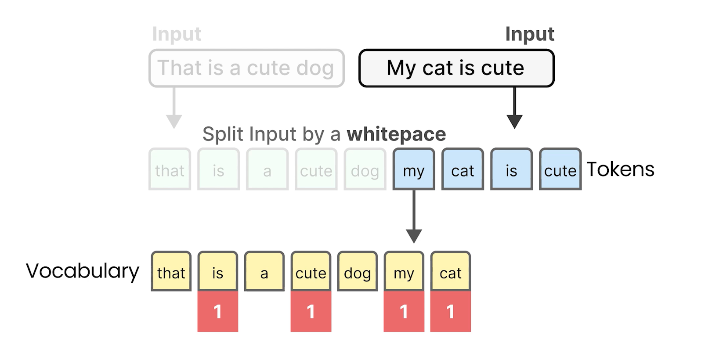

Tuttavia, abbiamo prendere nota delle parole nel vocabolario che non appaiono nell'input.

Una frase non da solo significato alle parole che contiene, ama anche le parole che non contiene.

Ora che abbiamo contato quanto spesso le parole o tokens del nostro input compaiono nel vocabolario, abbiamo creato la nostra rappresentazione numerica che viene chiamata Bag-of-words che non fa altro che contare le singole parole the compaiono nel vcabolario.

Quindi la rapprsentazione numerica di "My cat is cute" è: 0101011 in tale ordine specifico.

L'ordine è importante poichè ci consente di confrontare frasi diverse tra loro.

In pratica, noi chiamiamo questo **Rappresentazione Vettoriale**, una lista di valori numerici che rappresentano l'input.

Nel nostro esempio (Bag-of-Words) tali valori numeri sono conteggi di quanto spesso le parole del vocabolario compaiono nella frase di input

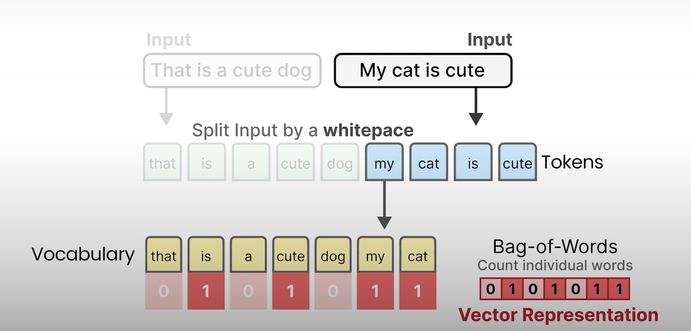

Le **Rappresentazioni vettoriali** in modelli più avanzati e complessi tipicamente non hanno valori così intuitivi ed hanno valori tra 0 e 1.

## Word Embeddings

Bag-of-word ha un difetto. Considera il linguaggio come al massimo una borsa di parole letteralmente, ed ignora la natura semantica o significato del testo.

**Word2Vec** è stato uno dei primi tentativi di successo nel catturare il significato del testo in Embeddings.

Per fare ciò, Word2Vec ha imparato la rappresentazione semantica delle parole dall'addestramento di un vasot ammontare di dati testuali.

Per generare queste rappresentazioni semantiche, Word2Vec usa le reti neurali.

Queste reti consistono in layers di nodi interconnessi che processano l'informazione.

Le reti neurali possono avere molti livelli di cui ciascuna connessione ha una certo peso, questi pesi spesso si riferiscono ai paremetri del modello.

Utilizzando queste reti neurali, Word2Vec genera i **word embeddings** guardando a quali altre parole esse tendono ad essere vicine in una data frase.

Iniziamo col assegnare a ciascuna parola nel nostro vocabolario con un vector embedding, diciamo, di cinque valori per ciascuna parola, è inizializzato con valori random.

Poi in ogni training step, prendiamo una coppia di parole dal training data, ed il modello cercherà di prevedere se o no esse sono probabilmente vicine in una frase.

Durante questo processo di addestramento, Word2Vec impara le relazioni tra le parole e distilla l'informazione negli embeddings.

Se le due parole tendono avere lo stesso vicino i loro embeddings saranno vicini uno all'atro e viceversa.

Gli embeddings risultanti catturano il significato delle parole.

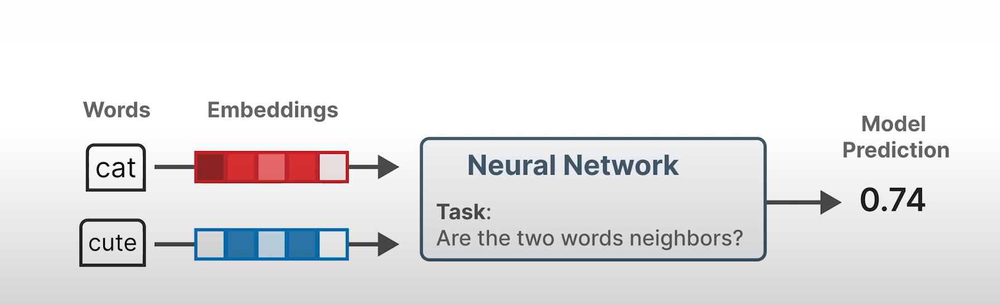

### Cosa significa che gli emebedding catturano il significato delle parole?

Vediamo un esempio.

Assumiamo di avere un embedding per la parola "cats".

Tale embedding ha generato valori tra -1 e 1. Gli embeddings cercano di catturare il significato rappresentando le proprietà delle parole.

Ad esempio, la parola "cats" potrebbe avere valori bassi sulle proprietà "newborn", "human" e "fruits", metre ha punteggi alti sulle proprietà "animal" e "plural".

Il numero delle proprietà o valori che un embedding ha, è chiamata **numero di dimensioni** ed è generalmente una dimensione fissa.

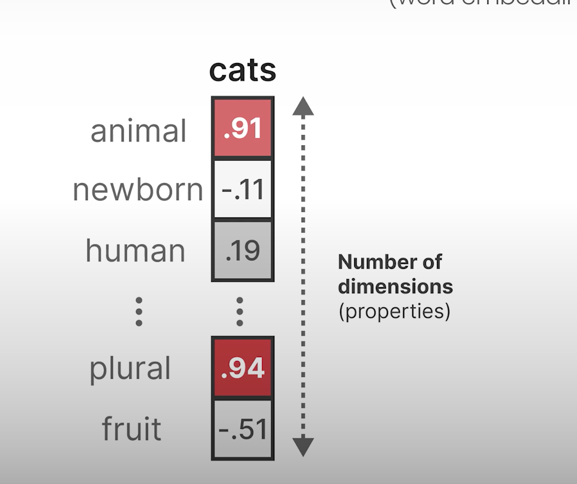

Lo stesso possiamo dire per le altre parole come "puppy", la quale ha valori elevati su "animal" e "newborn", ma bassi valori sulle tutte le altre proprietà.

Facendo lo stesso per un certo numero di parole, possiamo utilizzare questi valori per avere una prossimità dei significati di queste parole

Notare che il numero delle dimensioni può essere abbastanza grande, mentre non è comune vedere embeddings con più di un migliaio di valori.

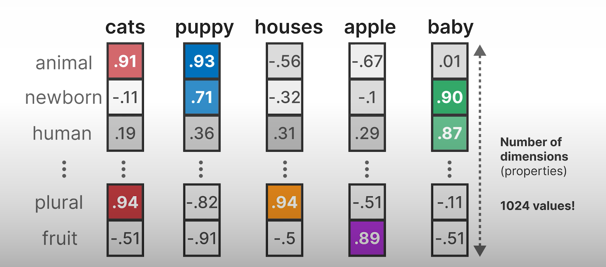

Tuttavia in pratica non sappiamo veramente cosa queste proprietà rappresentano esattamente.

Tali proprietà ci consentono di comparare gli embeddings e quindi le parole con le altre.

Parole con significato similare saranno raggruppate assieme, mentre parole diverse sono più distanti. Quanto similari o dissimili sono certe parole dipende dai dati di addestramento.

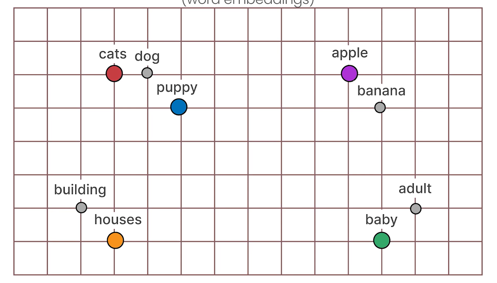

Finora abbiamo esplorato il word embedding, ma ci sono molti tipi di embedding che possiamo utilizzare.

Quando abbiamo parlato del Wor2Vec che converte input testuali in embeddings ci riferiamo ad esso come un **Rappresentation Model** come tentativo di rappresentare il testo come valori.

Immaginiamo di avere un certo input, ad emsempio la frase "Her vocalization was melodic".

Tramite la tokenizzazione possiamo splittare la frase in tokens.

Notare che questa procedura non splitta effettivamente l'input in base agli spazi.

La parola "vocalization" viene splittata in ["vocal", "ization"].

La ragione di questo è che i modelli che performano la tokenizzazione, detti **tokenizers**, hanno un vocabolario fisso.

Come tale, non possonon rappresentare tutte le parole che esistono, ma a volte devono trovare combinazioni di parole.

Diamo al modello di rappresentazione questi token individuali, il quale poi genera gli embeddings per ogni token.

Notare che la parola "vocalization" contiene i tokens, "vocal" e "ization".

Così quando facciamo la media degli embeddings di questi due tokens ("vocal", "ization") otteniamo un **word embedding** che rappresenta la parola intera "vocalization"

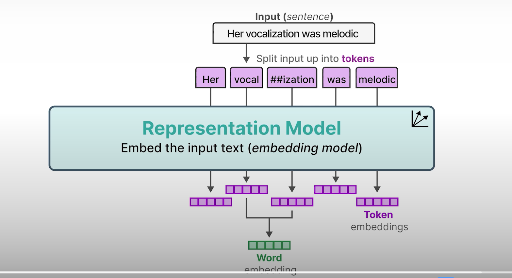

Tecniche simili possono essere utilizzate per frasi intere per creare **sentence embeddings** e lo stesso per testi lunghi come documenti per creare **document embedding**.

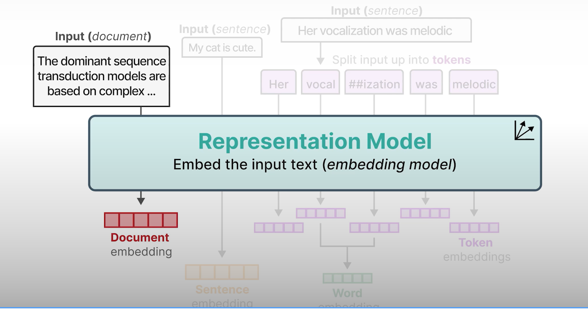

## Encoding and Decoding Context with Attention

Word2Vec crea embeddings statici. Lo stesso embedding è generato per la parola "bank", indipendentemente dal contesto.

"bank", può riferirsi sia a financial banck così come the bank (riva) of a river.

Il suo significato (di "bank") e quindi anche il suo embedding dovrebbe cambiare in base al contesto. 

Catturare il contesto del testo è importante per performare alcuni language tasks, come la traduzione.

Un passo per codificare il testo è stato raggiunto tramite le Recurrent neural networks o RNNs.

Queste sono una variante delle reti neurali che possono modellare le sequenze come un input addizionale.

Per fare ciò, le RNNs sono usate per due tasks, encoding o rappresentare una frase di input, ed il decoding o generare una frase di output.

Vediamo un caso d'esempio come la frase di input "I love llamas" viene tradotta in tedesco.

Il testo viene passato all'encoder, il quale rappresenta l'intera sequenza tramite gli embeddings. 

Il decoder poi usa questi embeddings per generare il linguaggio.

Nel nostro caso traduce dall'inglese "I love llamas" al tedesco "Ik hou van lama's".

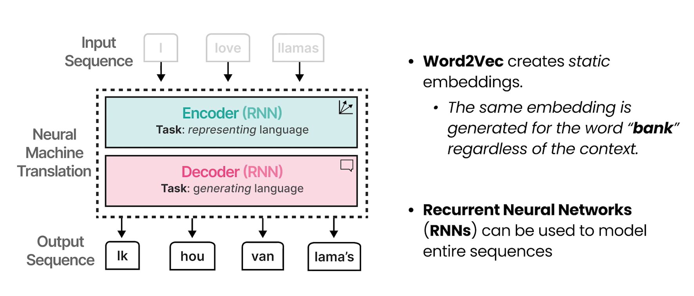

### Autoregressive

Each step in questa architettura è autoregressiva.

Quando genera la parola succesiva, tale architettura deve consumare tutte le precedenti parole generate.

Per esempio, prendiamo l'input "I love llamas", il modello genera il primo token, ovvero "Ik".

Per poi generare il token successivo, l'output "Ik" è aggiunto agli inputs.

Nello step 2, l'input è "I love llamas ik", che a sua volta genera l'output "hou".

Possiamo continuare questo processo ad ogni step, ed aggiornare continuamente gli inputs con il token generato nello step precedente fino a quando l'intero output è generato.

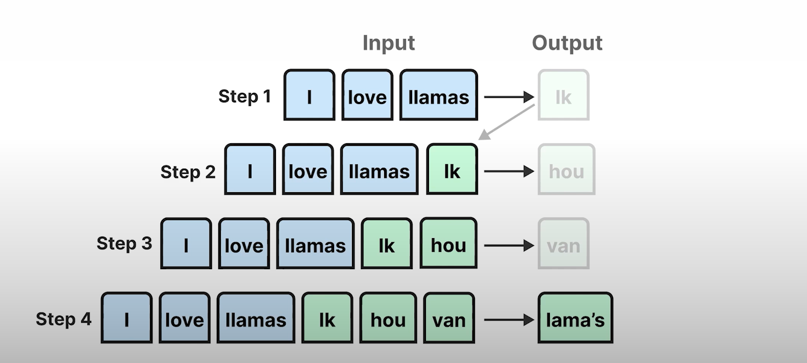

La maggior parte dei modelli sono autoregressivi e sarà quindi generato un singolo token ogni volta.

### Encoding and Decoding Context

Vediamo il processo si encoding e decoding più in dettaglio.

Iniziamo ancora con la frase di input "I love llamas" tokenizzata in tokens.

Possiamo utilizzare Word2Vec per creare gli embeddings come inputs. Anche se questi embeddings sono statici, l'encoder processa l'intera sequenza in una sola volta e prende in considerazione il contesto degli embeddings.

Lo step di encoding ha come obiettivo quello di rappresentare l'input il meglio possibile, e generare il contesto nella forma di un embedding.

Il decoder a sua volta è responsabile di generare il linguaggio, e lo fa sfruttando il context embedding precedentemente generato per generare alla fine gli outputs.

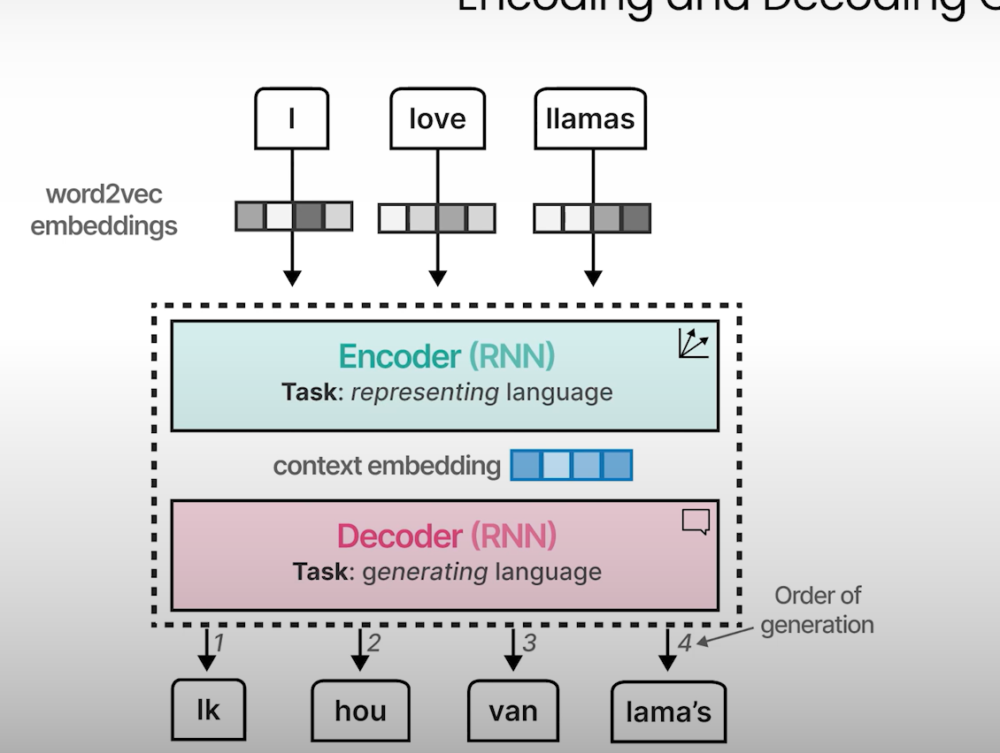

Come abbiamo visto prima questi output tokens sono generati una alla volta, il quale viene detto autoregressivo.

Questo context embedding, tuttavia, rende difficoltoso la gestione con contesti più lunghi, poichè è meramente un singolo embedding che rappresenta l'intero input.

Quindi il singolo embedding potrebbe fallire nel catturare l'intero contesto di una lunga e complessa sequenza.

### Attention

Nel 2014 una soluzione chiamata **Attention** è stata introdotta che ha altamente migliorato sull'architettura originale.

**Attention** consente il modello di concentrarsi su parti della sequenza di input che sono rilevanti ed amplificare il loro segnale.

**Attention** determina selettivamente quali parole sono più importanti in una data sequenza.

Prendiamo come esempio le nostre sequenze di input e output (I love llamas, Ik hou van lama's)

Le parole con significato similare come "I" ed in tedesco "Ik", i quali sono sinonimi, hanno pesi di attenzione elevati poichè sono piuù relativi.

"I" e "llamas" hanno bassi attention weights, poichè essi non si relazionano molto tra di loro in questa frase in particolare.

E lo stesso applicato per tutte le altre parole.

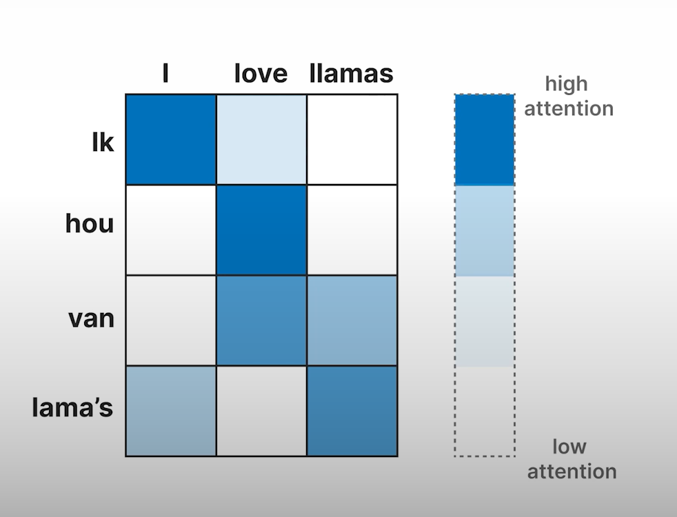

Aggiungendo questo meccanismo di attenzione allo step di dencoder la RNN può generare segnali per ciascuna parola di input nella sequenza relazionata agli outputs potenziali.

Possiamo, aconra, rappresentare l'input usando Word2Vec embeddings e passare questi embeddings all'encoder.

Invece di passare solo un context embedding al decoder, gli hidden states di tutte le parole di input vengono passate al decoder. Una parola statica è un vettore interno da un hidden layer di una RNN che contiene la informazione delle precedenti parole. 

Il decoder poi utilizza l'attention mechanism per vedere l'intera sequenza. Infine genera il linguaggio.

Per via del meccanismo di attenzione, l'output tende ad essere molto migliore poichè ora guardiamo all'intera sequenza usando gli embeddings per ciascun token o parola invece di un più piccolo e più limitato context emebedding.

Quindi durante la generazione il modello si concentra sugli inputs più rilevanti.

Dopo aver generato "Ik hou van" dall'utilizzo degli inputs "I love llamas", il meccanismo di attenzione poi evidenzia le parole che sono più rilevanti in questo particolare esempio

La natura sequenziale di questa architettura preclude la parallelizzazione durante l'addestramento del modello.

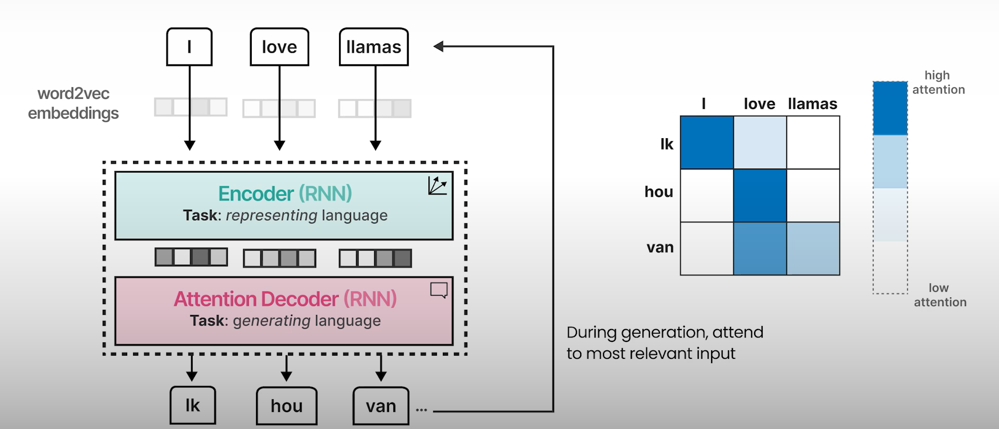

## Transformers 

Il vero potere dell'Attention e ciò che alimenta le meravigliose abilità nella maggior parte dei **Large Language Models**, fu per primo esplorata in **The Attention is All you need** paper.

Tale paper introduce l'architettura Transformers, la quale è basata esclusivamente sull'Attenzione senza la Recurrent neural network.

Questa architettura consente al modello di essere addestrato in parallelo, il quale accelera il calcolo significativamente comparato alle RNN based model, il quale preclude la parallelizzazione.

### Vediamo come funzionano i Transformer

Assumiamo di avere le stesse sequenze di input e di output come prima (I love llamas, Ik hou van lama's).

Il **Transformer** consiste in blocchi encoders e decoders impilati.

Tali blocchi tutti hanno lo stesso meccanismo di attenzione che abbiamo visto prima e impilando questi blocchi, amplifichiamo la forza dell'encoder e decoders.

Diamo un'occhiata più da vicino all'encoder.

L'input "I love llamas" è convertito in embeddings, ma invece del Word2Vec embeddings, iniziamo con valori random.

Poi self-attention, in cui l'attenzione è concentrata solo sull'input, processa questi embeddings e gli aggiorna.

Questi embeddings aggiornati contengono informazione molto più contestualizzata come risulatto del meccanismo di attenzione.

Essi vengono passati ad una feedforward neural network, la quale infine crea token word embeddings contestualizzati.

Ricordiamo che l'encoder è inteso per rappresentare il testo e fa un buo lavoro di generazione di embeddings.

**Self-attention** è un meccanismo di attenzione e invece di processare due sequenze, esso processa solo una sequenza di inputs comparandoli con se stessi.

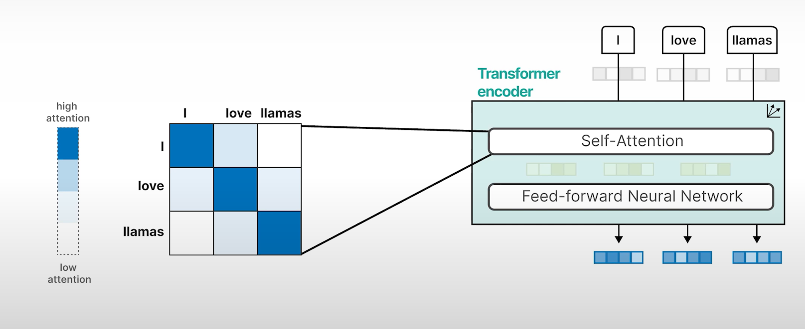

Ora, dopo che gli encoders sono stati fatti processando l'informazione, il prossimo passo è per il decoder.

Il Decoder può prendere ogni parola precedentemente generata e passarla nella **masked self-attention**, simile all'encoder per processare questi embeddings.

Degli embedding intermedi sono generati e passati ad un'altra Encoder network assieme con gli embeddings dell'encoder, quindi processando entrambi (ciò che è stato generato e ciò che già abbiamo).

Questo output è passato ad una rete neurale feedforward e infine genera la seguente parola nella sequenza.

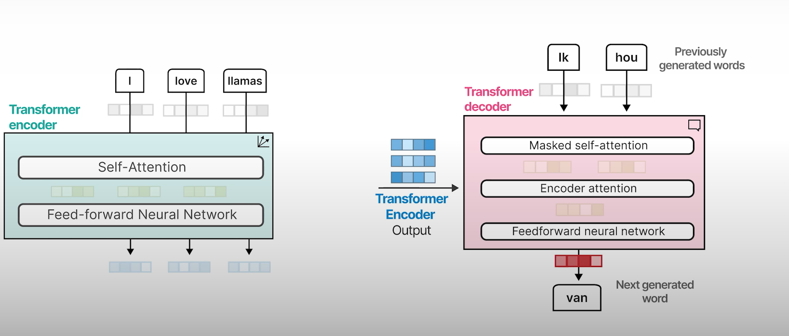

### Masked self-attention

Masked self-attention è simile alla self-attention ma rimuove tutti i valori della parte superiore alla diagonale. Quindi, questo maschera posizioni future cosicchè ciascun token dato può solo dare attenzione ai tokens che vengono prima di lui.

Questo aiuta a far trapelare informazioni quando generiamo l'output.

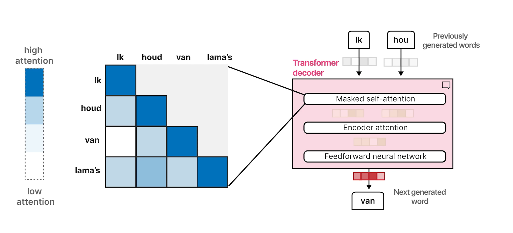

### Representation Models (BERT)

L'originale Transformer model è una architettura encoder-decoder che svolge il compito della traduzione bene,  ma non può essere facilmente utilizzato per altri tasks come il text classification.

Nel 2018 una nuva architettura chiamata Bidirectional Encoder Representations da Transformers o BERT è stata introdotta che può essere utilizzata per una ampia gamma di tasks.

BERT è una architettura encoder only che si concentra nel representing language e generare contextual word embeddings.

Questi blocchi di encoder sono gli stessi cha abbiamo visto prima (self-attention vicino a reti neurali)

L'input contiene un token addizionale il CLS o classification token, il quale è usato come una rapprsentazione per l'input intero. 

Spesso utilizziamo questo CLS token come l'input embedding per fine-tining il modello su un task specifico come la classificazioen

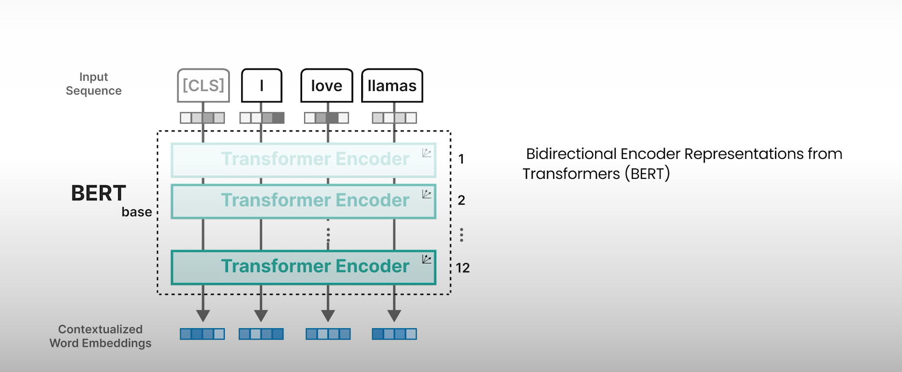

Per addestrare un modello BERT-like possiamo usare la tecnica chiamata **masked language modelling**.

Prima mascheriamo un numero di parole randomicamente dalla nostra sequenza di input e il modello deve predire queste parole mascherate.

Facendo questo, il modello impara a rappresentare il linguaggio poichè prova a destrutturare queste masked words.

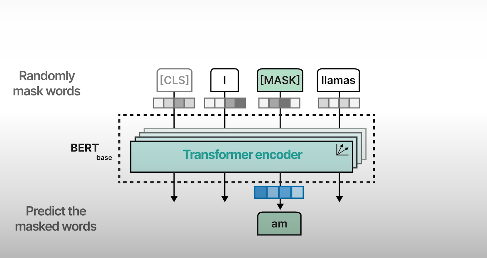

L'addestramente è tipicamente un'approccio a due step.

Prima applichiamo masked language modelling su un grande insieme di dati, e questo viene chiamato pre-training.

Dopo di esso possiamo fine-tunare il nostro modello pre-trained su un numero di tasks inclusa la classificazione.

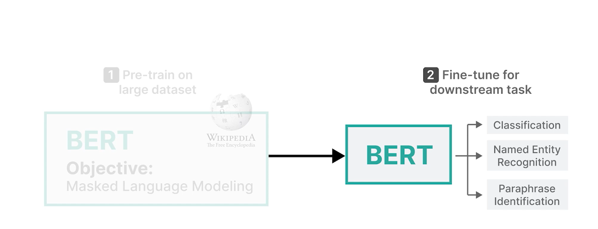

### Generative Models

I modelli generativi invece usano una architettura differente.

Assumiamo che, di nuovo, abbiamo una sequenza di input e degli embeddings inzializzati randomicamente.

L'input è poi passato solo al decoder come modello generativo tende solo ad impilare decoders.

Una delle prime implementazioni è chiamata GPT o GPT-1 (Generative Pre-trained transformer) dato che usa il deep transformer decoder.

Un blocco decoder usa, di nuovo, masked self-attention la quale è poi passata alla rete neurale feed-forward.

Notare che non si fa uso di nessun encoder come abibamo visto prima. 

Infine la parola successiva viene generata.

Questi sono due gusti che vedremo molto spesso, **Generative Models** come GPT, e **Rapresentation Models** come BERT.

### Context Length 

Questi modelli hanno qualcosa in comune chiamato **context length**.

Iniziamo da una sequenza di input: "Tell me something about llamas." che chiediamo al **generative model**.

Ora diciamo che ha già generato alcuni token precedentemente.
La query originale, assieme a questi token prcedentemente generati rappresentano il **context length** corrente. Questo è il numero di tokens che stanno correntemente essendo processati.

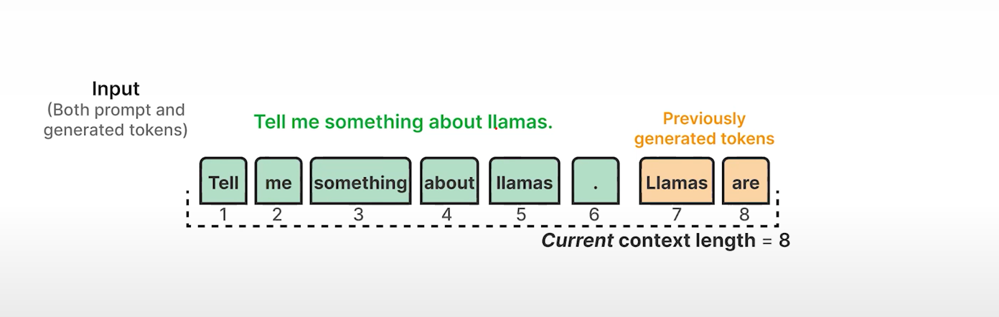

In contrasto, un **Generative LLM** come GPT-1 o anche un **representation model** possono avere un massimo context length ad esempio di 512.

Questo significa che il modello può solo processare 512 tokens per volta.

Notare che questo include anche i tokens che sono stati generati poicheè essi aggiornano il context length corrente.

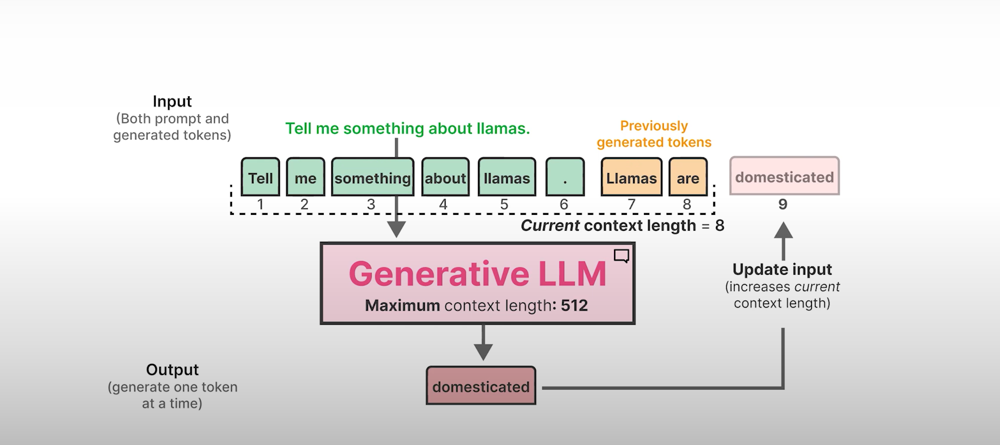

### Parameters

Questi modelli generativi rendono giustizia al nome large language models.

GPT-1 ha più di 100 milioni di parametri.

La versione successica, GPT-2 con più di 1 miliardo di parametri e GPT-3 con circa 175 miliardi di parametri.

Come il numero di parametri cresce anche le loro capacità crescono.