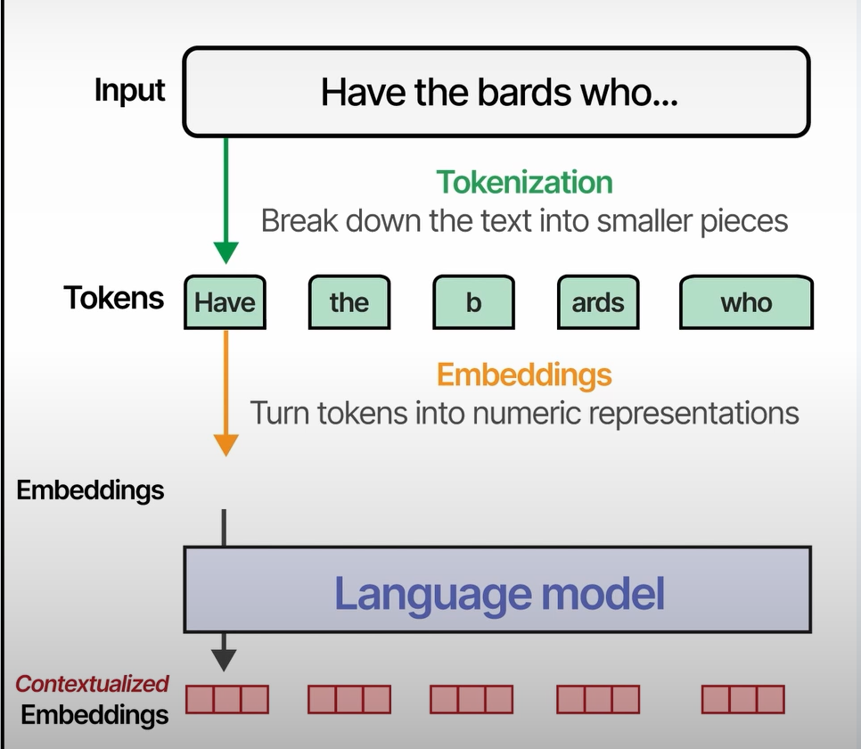

# Tokenizers

Immaginiamo di avere una frase di input come "Have the bards who...", per un language model processare tale input, dovrà prima 
scomporre il testo in parti più piccole, ciascuna parte è chiamata token.

Tale processo di scomporre il tetso è chiamato **tokenizzazione**.

Ciascun token è convertito in una rappresentazione numerica, detta embeddings.

Questi (embeddings) sono vettori numerici che rappresentano la natura semantica del dato testo.

Gli emebddings sono statici e creati in modo indipendente dagli altri embeddings e tokens.

Questi embedding sono processati dall'LLM e convertiti in contextualized emebddings.

Tali contextualized emebedding sono ancora per ciascun token di input, ma sono stati processati **in modo che tutti gli altri tokens sono considerati**.

Questi embeddings possono essere l'output di un modello, ma anche essere usati dal modello per poi creare gli outputs.

Nel caso dei modelli generatici questi saranno altri tokens che poi saranno decodificati in parole.

