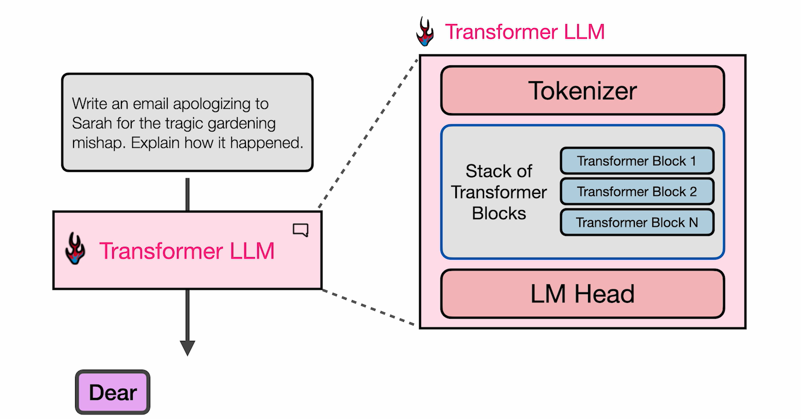
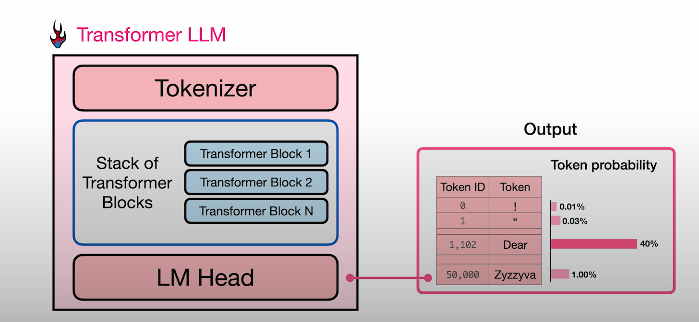
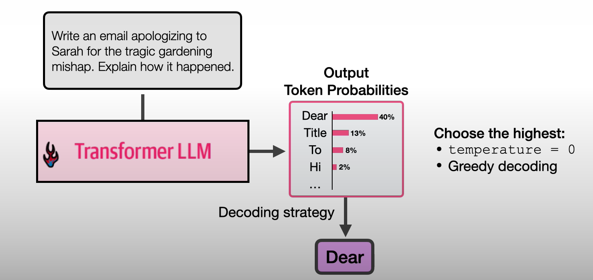
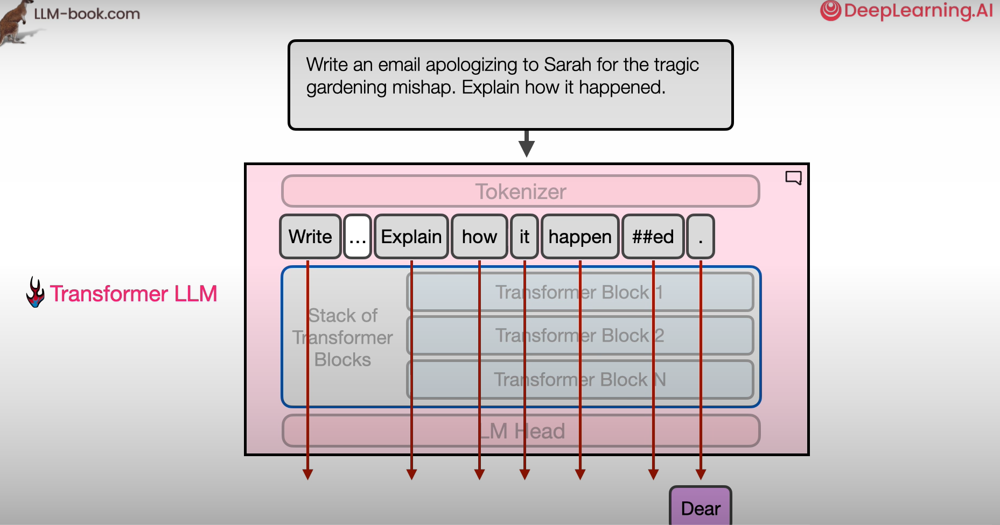
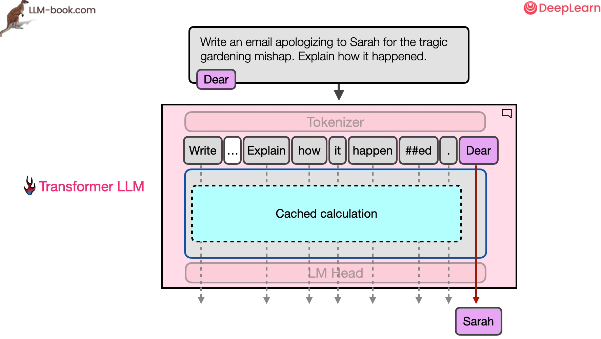

# Architectural Overview of Transformers

Quando pensiamo ai Transformers LLM, sappiamo che c'è un prompt di input al modello e poi c'è una generazione dove un output di testo viene generato dal modello.

Un primo passo per comprendere i Transformers che capire che essi generano gli output un token alla volta.

Vediamo più in dettaglio come avviene tale meccanismo sottostante.

## Three major components: Tokenizer, Transformer Block, e LM head

Il transformer è composto da tre componenti principali:

1. Tokenizer:
    Componente che scompone il testo in parti più piccole, e poi l'output del tokenizer va nello stack (pila) di Transformer Blocks.
    
2. Transformer Blocks:
    Questi sono le reti neurali che operano su quello fornito dal tokenizer e fanno tutta la magia.

3. LM Head:
    L'output dello stack di Transformer Blocks entra in una Rete Neurale detta la **Language Modeling Head**

vediamo più accuratamente questi componenti.

Abbiamo visto un **Tokenizer**, e sappaimo che una tokenizer ha un vocabolario. per esemipio diciamo di avere un vocabolario di 50000 tokens che il tokenizer conosce.

Il modello ha associato token embeddings a ciascuno di questi tokens. Quindi se abbiamo 50000 tokens nel nosto vocabolario, il modello ha 50000 vettori che rappresentano ciascuno di questi tokens.

Parleremo dei **Transformer Blocks** nella prossima lezione quindi andimao oltre e vediamo il **Language Model Head**.

Alla effetiva fine del processo di un language model, abbiamo i tutti i nostri tokens con i quali abbiamo iniziato che sono definiti nel tokenizer. Quello che avviene alla fine è una sorta di assegnazione di uno score o un calcolo del probabilità di un token basato su tutto il processamento che il modello ha fatto nello stack dei transformers, per dare senso al contesto di input e quello che è richiesto nel prompt e cosa il token seguente dovrebbe essere per rispondere a tale prompt e contesto.

E quindi il risultato di un language modeling è questa sorta di token probability.

Dunque si assegna una probabilità a tutti i tokens del tokenizer, se sommiamo tutte le probabilità assegnate a ciascun token che conosciamo (del vocabolario del tokenizer) otteniamo il 100%.

Quindi se abbiamo che il token della parola "dear" ha una probabiltà o score del 40%, questa sarà la più alta probabilità che tale token diventi **possibilmente** il token di output, non necessariamente il token di output effettivo, ma possimao scegliere come token di output quello con la probabilità più alta.

Questa è una strategia o metodo nel scegliere il next o output token. Queste vengono chiamate **decoding strategies**.

Se scegliamo il top-scoring token tutte le volte, è una buona strategia  per molti casi. È quello che avviene se settiamo la **temperature** a 0. 

Ma non è l'unico metodo per scegliere il next o output token.
Ce ne sono altri come **Top_P**, che incorpora molteplici tokens, quindi potrebbe generare "dear" ma in alcuni casi con minore probabilità, potrebbe scegliere il token con la seconda probabilità più alta. Questi sono a volte importanti per generare testo che sembri naturale. Ecco perchè quando generiamo più volte utilizzando lo stesso prompt otteniamo due risposte diverse. Questo è dovuto alle decoding strategies, specialmente quando usiamo una temperatura > 0.

## Parallelizzazione

Un'altra importante idea o intuizione circa i transformers, e questa è una delle idee che fan si che i Transformers funzionino meglio dei metodi precedenti come le RNNs, è che essi processano tutti i token di input in parallelo , e tale parallelizzazione li rende più efficienti in termini di tempo. Quindi possiamo calcolare un contesto lungo su molte GPUs diverse allo stesso tempo. Il modo si immaginare questo è quello di pensare a molteplici tracce che scorrono attraverso lo stack di Transformers Blocks e il numero di tracce in questo caso è il context size del modello.

Quindi se un modello ha per esempio un context size di 16000 tokens il modello può processare 16000 tokens allo stesso tempo.

Il token generato nel decoder LLM transformers è l'output del token finale nel modello.

## KV Caching

Vediamo nella seguente slide come generare ogni altro token dopo che abbiamo iniziato col primo step che processa l'input è un po' diverso.

Qui vediamo che tutte le freccie sono rosse ma poi una volta che abbiamo generato il nostro primo token, alimentiamo l'intero prompt con il token che abbiamo generato dentro il transformer di nuovo.

È un loop e poi processiamo gli inputs uno per uno mentre si generano questi tokens.

Una cosa che è difersa tra il primo step e il secondo step è che possiamo mettere in cache questi calcoli dato che saranno esattamente gli stessi calcoli.

POssiamo metterli cache per velocizzare le generazione del modello.

Questo è quello che viene chiamato **KV caching**.

Se lavoriamo con l'efficienza c'è una metrica del **time to first token**. Questo è quanto il modello impiega per processare tutto il prompt e generare il primo token. POi generare i successivi token è solo un processo leggermente diverso.

