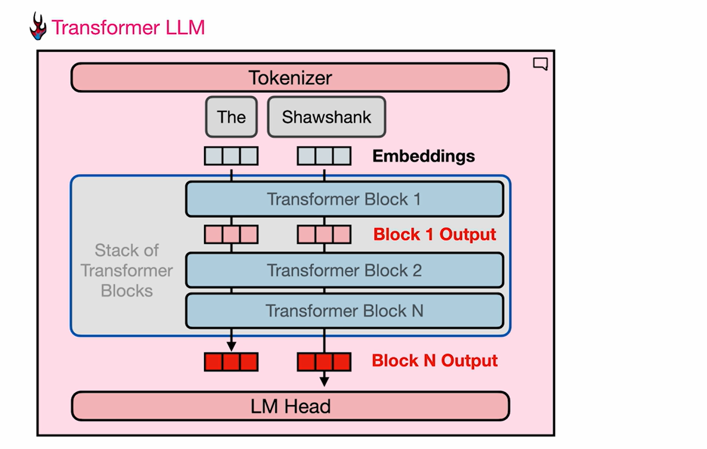
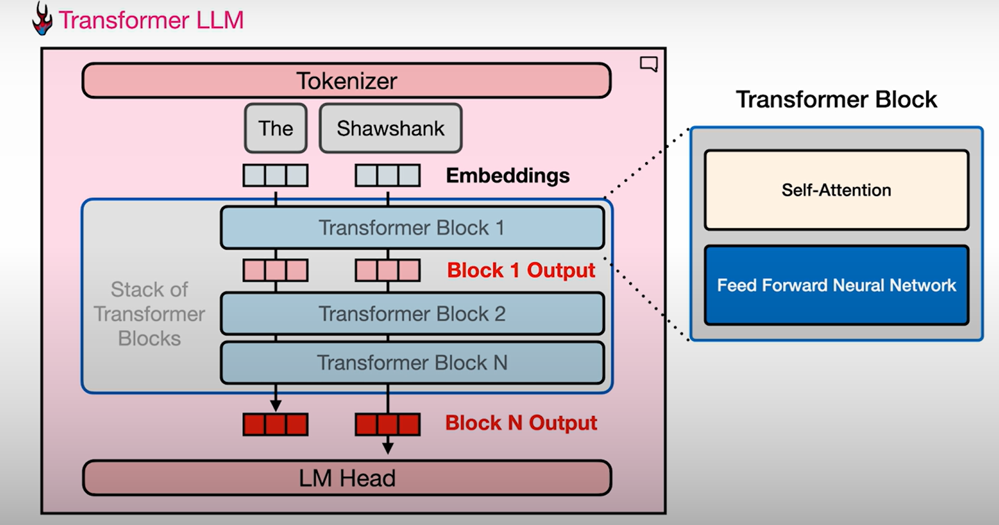
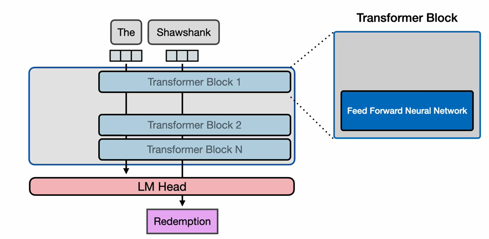
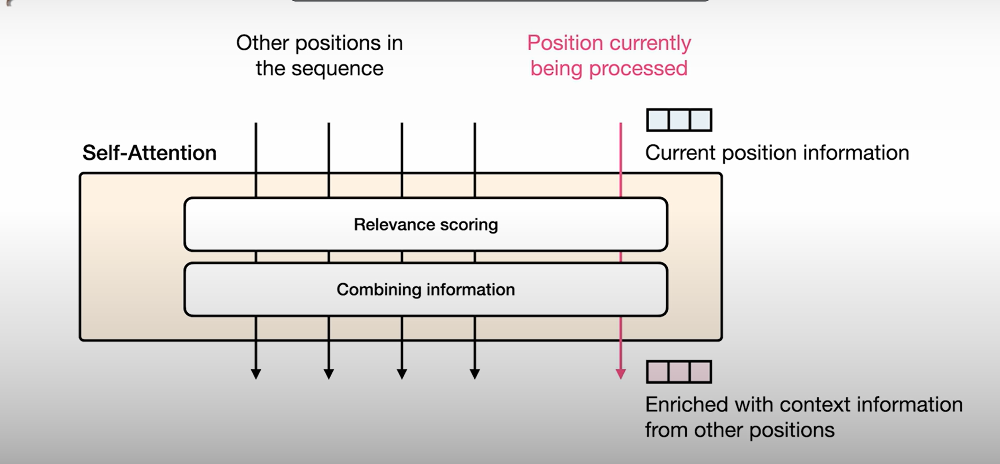

# The Trabsformer Block

Abbiamo visto che dopo la tokenizzazione i token embeddings vengono passati attravero uno stack di transformer blocks.

Vediamo più in dettaglio tali blocks.

Analizzimao un semplice esempio. 

Diciamo di avere "The Shawshank". Per capire come i transformer blocks operano pensiamo a due tracce che scorrono attraverso lo stack di transformer blocks.

All'inizio il nostro tokenizer scompone il prompt in questi due tokens "The" "Shawshank". POi dato che abbiamo i vettori emebeddings associati a ciascuno dei tokens li rimpiazziamo con questi. E su questi iniziamo a fare i calcoli.

Ora, abbiamo convertito il language in numeri e possiamo applicare molti calcoli interessati su di essi per prevedere qual'è la prossima parola.

Quindi, questi flussi vanno nel primo transformer block il quale genera un vettore della stessa dimensione degli inputs come suo output.

Ma qualcosa è avvenuto nel mezzo del transformer block, qualche processo è avvenuto al suo interno nei suoi componenti che andiamo ad affrontare.

Ma prima di addentrarci in esso, questo flusso generale scorre attravero il modello. E quindi la stessa cosa accade anche nel secondo transformer block che opera sugli outputs del primo transformer block in parallelo per le varie traccie. E questo si ripete scendendo lungo la lista dei transformer blocks fino alla fine. Poi il livello finale, diciamo il vettore dell'ultimo token nel prompt è presentato al Language Modeling Head. Il quale poi genera il next token previsto.

## Transformer Block components

Il transformer block stesso è composto da due componenti principali:

1. Self-attention layer 

2. Feed-forward neural network layer

### Feed-forward neural network layer

Se i transformer blocks avessero soltanto questa componente senza il self-attention layer, essi sarebbero in grado di generare i vettori per dire che il token più probabile che viene dopo il token "Shawshank" sarebbe "redemption", in riferimento al famoso film, poichè se guardiamo l'addestramento, se abbiamo dato data sets con dati da internet o wikipedia, "redemption" sarebbe la parola che più spesso statisticamente appare dopo "Shawshank". 

Questa è una cosa che le feed-forward neural network sono in grado di fare. 

Possiamo pensarle come uno storage di informazione e di statistiche di next word che vengono dopo il token di input.

### Self-attention layer

D'altro canto self-attention, consente al modello di occuparsi dei tokens precedenti ed incorporare il contesto nella sua comprensione del token che sta attualmente guardando.

Vedimao il segunete esempio. Diciamo di avere il prompt:

"The dog chased the llama because it"

Il modello sta processando la parola "it", il modello deve inserire qualche informazione circa a cosa "it" si riferisce in questo caso. È "it" il cane o il llama?

È importante per il modello avere qualche info circa a cosa "it" si riferisce. E questo è un po' di quello che self-attention fa.

Self-attention capacita il modello di inserire qualcosa della rappresentazione del token "llama" ad esempio, se il contesto precedente indica che si tratta del LLama, self-attention permette al modello di inserire un po' della rappresentazione di LLama dentro "it". Dunque metre il modello processa il token "it" ha qualche comprensione che questo si sta riferendo al LLama.

Questo è un task di NLP chiamato co-reference resolution, e se queste sono solo le parole che ci sono presentate, che ci vengono date (The dog chased the llama because it), potrebbe essere difficoltoso accertare se "it" è il cane o è il llama.

Per questo esempio assumiamo che i tokens precedenti nel prompt indicano che "it" è il Llama.

Quindi per comprendere Attention ad un alto livello, lo formuliamo come questo.

Abbiamo altre posizioni nella sequenza, quindi abbiamo i token precedenti che abbiamo processato nel passato.

E poi abbiamo la posizione corrente che stiamo processando. Abbiamo la sua rappresentazione vettoriale, quindi abbiamo l'embedding se siamo nel transformer nel blocco numero 1.

Ma se siamo siamo nel blocco numero 2 o 3 .... tale embedding rappresenta l'output del blocco precedente.

Poi verso la fine vogliamo questa rappresentazione vettoriale che inserisce le informazioni rilevanti delle altre posizioni.

Dunque diciamo che stiamo guardando queste 5 tracce e in sostanza stiamo tirando la giusta informazione che è utile per rappresentare l'ultimo token (traccia in rosso) in questo step del modeling processing.

Questa è solo una formulazione ad alto livello della self-attention, entreremo più nello specifico poi nella sezione dedicata al self-attention.

Ma in sostanza quello che self-attention fa sono due cose.

1. Relevance scoring: si assegna un punteggio di quanto rilevante ciascun tokens di input sono per il token che sta essendo processato.

2. Combining information: combiniamo l'informazione dei tokens più rilevanti dentro il vettore corrente (rappresentazione del token che sta essendo processato).

