# 🧠 Self-Attention nei Transformer

## 📌 Panoramica Generale

La **Self-Attention** è un meccanismo chiave nei transformer, fondamentale per determinare la rilevanza contestuale tra parole all’interno di una sequenza. Si compone di **due fasi principali**:

1. **Relevance Scoring** – Calcolo del grado di rilevanza tra token.
2. **Combining Information** – Combinazione dei token più rilevanti per generare rappresentazioni arricchite.

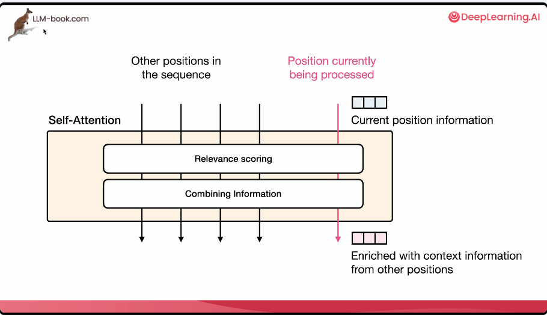

---

## 🔄 Architettura di Base

Ogni blocco di self-attention opera in una **attention head**, dove:

- Ogni token è rappresentato da un vettore.
- I vettori vengono trasformati tramite tre matrici di proiezione (projection matrices):
  - **Query (Q)**
  - **Key (K)**
  - **Value (V)**

Le matrici di pesi (`Wq`, `Wk`, `Wv`) sono utilizzate per calcolare le matrici Query, Key e Value. In ciascuna riga di esse è un vettore che rappresenta una posizione (token) nella sequenza.

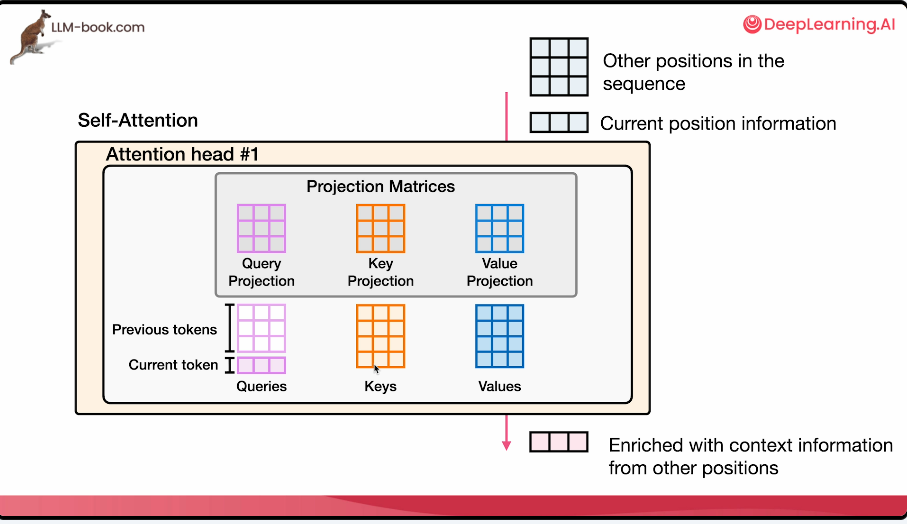

---

## 🧮 Relevance Scoring (Attenzione)

Ogni token che abbiamo ha uno score ad esso associato, che ci dice quanto rilevante è per il token corrente, che stiamo correntemente rapprsentando.

Nell'esempio abbiamo che "The" e "dog" hano lo score più alto, e quindi molto delle loro rappresentazioni saranno incluse nell'enriched vector del token corrente.

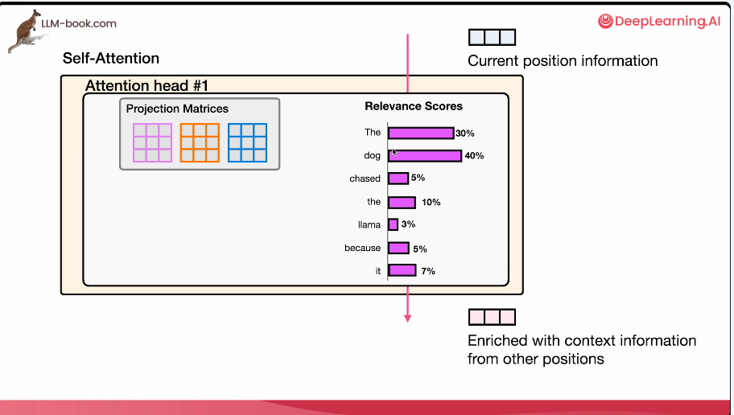

questo è in sostanza lo scopo del **Relevance Scoring**. Cioè darci questi score per i token precedenti per detrminare quali sono i più rilevanti per il token corrente.

### Relevance Scoring in Detail
Tecnicamente si fa tramite la moltiplicazione tra matrici.

Moltiplichiamo il vettore `queries` associato al token corrente con i vettori `keys` che rappresentano tutti i token precedenti.

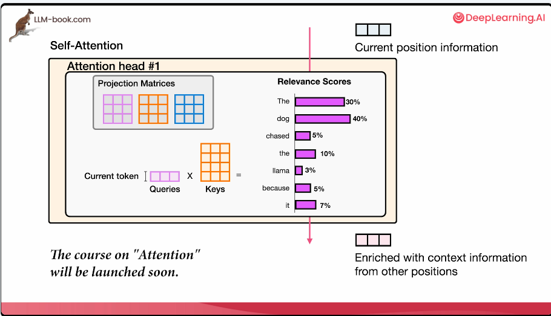


I punteggi ottenuti rappresentano **quanto ogni token è rilevante** per quello in analisi. I punteggi sono poi normalizzati con softmax per garantire che la somma sia 1 (o 100%).

Ora che abbiamo i **relevant scores** possiamo passare alla fase di **Combining Information**.

---

## 🎯 Combining Information (Combinazione Ponderata)

Il **combining information** viene fatto utilizzando i **Values Vectors** associati a tutti i token precedenti.

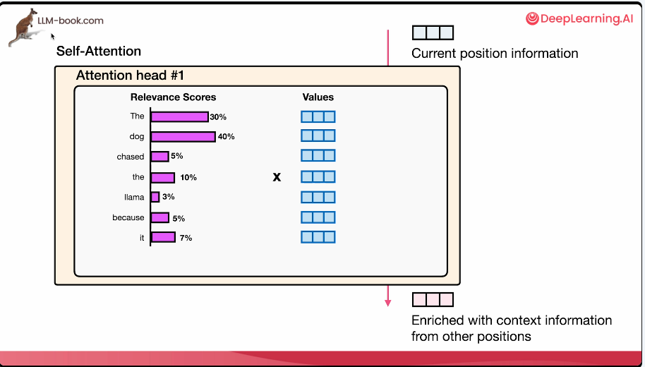

Dopo aver ottenuto i punteggi di attenzione:

1. Ogni `Value` è moltiplicato per il proprio punteggio.

Questo ci danno i **weighted values**.

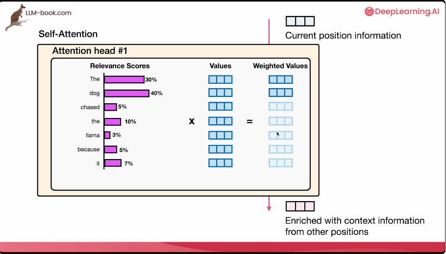

2. I vettori risultanti (weighted values) sono sommati:
   ```
   Output = Σ (score_i × value_i)
   ```

Il risultato è una rappresentazione arricchita del token attuale.

---

## 🧠 Multi-Head Attention

- Il processo (Relevance Scoring+ Combining Information) viene eseguito **in parallelo** su più **attention heads**.
- Ogni head ha le proprie matrici `Wq`, `Wk`, `Wv`.
- The Attention che assegniamo ai vari vettori (token) sono diversi di head in head, dato che hanno un set di matrici `Wq`, `Wk`, `Wv` diverse.


- Le uscite delle teste sono concatenate e proiettate per ottenere l'output finale.

---

## ⚙️ Ottimizzazioni Moderne

Per rendere il self-attention più efficiente, dato che è tipicamente uno step che prende molto tempo e richiede la maggior parte del tempo computazionale nei transformers, esistono diverse strategie di ottimizzazione:

### 🔁 Multi-Query Attention (MQA)

- L'idea è che tutte le attention heads **condividano** le matrici **Keys** e **Values**, quindi abbiamo solo una matrice `Keys` e una matrice `Values` per tutte le heads.
- ✅ In questo modo abbiamo meno parametri, maggiore velocità.

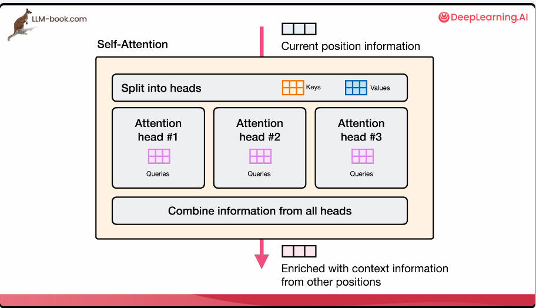


### 👥 Grouped Query Attention (GQA)

- Le heads sono divise in **gruppi** che condividono **Keys** e **Values**.

- Questo ci porta a migliori risultati rispetto a solo condividere una sola matrice `Keys` e `Values`.

- È particolarmente utile per modelli con grandi dimensioni (LLM) che rischiedono più parametri per rapprsentare i dati il che è richiesto quando abbiamo enormi sets di training data.

- ✅ Bilancia efficienza e capacità rappresentativa.

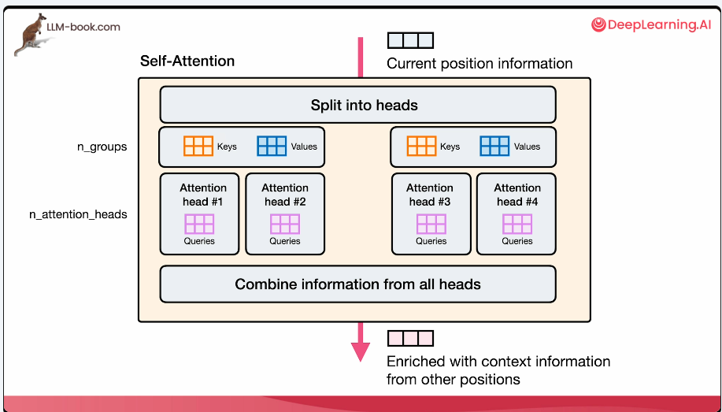

---

## 🧩 Sparse Attention

Un'altra importante idea recente per migliorare l'efficienza è la **Sparse Attention**.

Nell'esempio dove i token sono 7, quando arriviamo al settimo token, con la self-attention normale siamo in grado di dare attenzione a tutti i token che lo precedono.

Negli LLMs questo diventa molto costoso se lo facciamo ad ogni self-attention layer del transformer.

Dunque iniziamo a fare il self-attention in maniera intervallata. Ad esempio, il livello 2, livello 4 e livello 6 non faranno il self-attention per tutti i token nella storia, ma solo per gli ultimi 4 o 16 o 32 token.

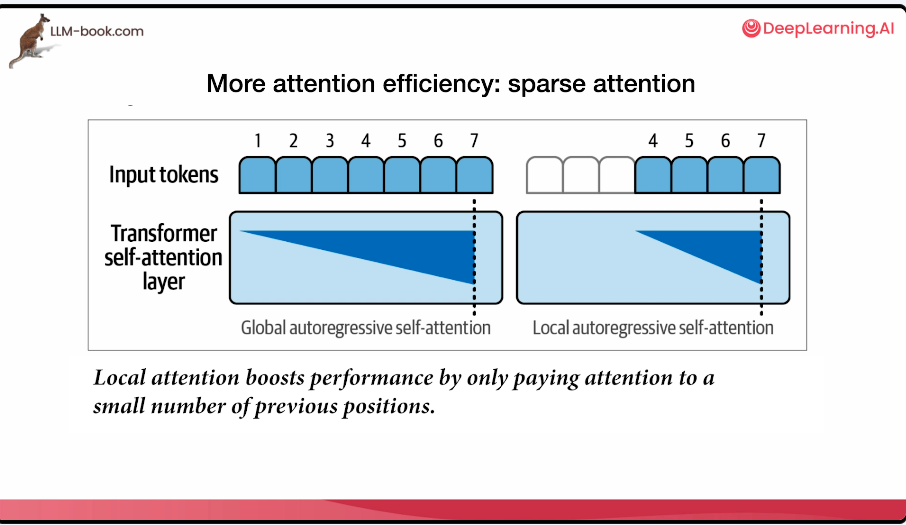


Analizziamo meglio:

Diciamo che abbiamo il token "The", lo processiamo e dato che non abbiamo token precedenti, non ha nulla da dare attenzione.

Il secondo token "dog" lo processiamo e questo da attenzione a entrambi i token "The" e "dog".

Poi abbiamo un terzo token "chased" e questo da attenzione a tutti i tre token. 

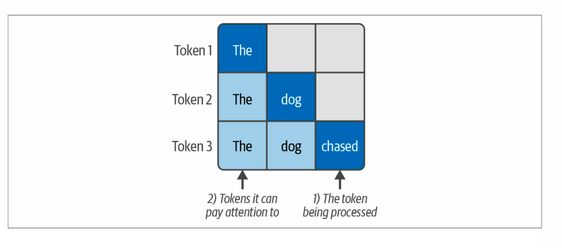

Vediamo un'immagine che spiega meglio lo sparse attention.

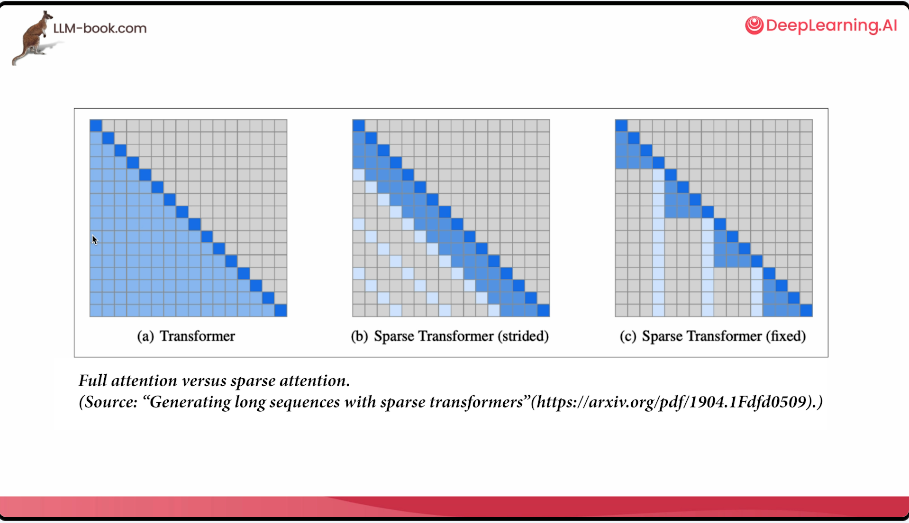

Nella figura a) vediamo il **full-attention** dove ciascun token può dare attenzione a tutti i precedenti. Pensiamo a ciascuna riga come uno step del processing. L'ultimo token (ultima riga) da attenzione a tutti i precedenti.

Nella **sparse-attention (strided)** dove ad ogni posizione (token) può guardare indietro al massimo di 3 o 4 token.


Nella **sparse-attention (fixed)** ci sono posizioni (token) fissate che dopo esse il token non può dare attenzione ai token precedenti. Ad esempio, dopo aver raggiunto il token numero 4 (riga 4) si ripete il pattern dove consentito guardare indietro solo ad un certo numero di token. Il token numero 5 (riga 5) non può dare attenzione ai precedenti. Il token numero 6 (riga 6) può dare attenzione solo al token precedente ecc. 

### Ricapitolando (sparse-attention)
Per grandi modelli, si limita l’attenzione a **sottoinsiemi** di token:

- **Full attention**: ogni token guarda tutti i precedenti.
- **Strided**: guarda solo gli ultimi 3-4 token o posizioni specifiche.
- **Fixed window**: guarda solo un intervallo fisso della sequenza.

✅ Riduce il costo computazionale.

---

## 🔄 Ring Attention

Tecnica recente per gestire **contesti lunghi** (fino a 1 milione di token). Le connessioni tra i token sono organizzate in **strutture ad anello** per migliorare l'efficienza.

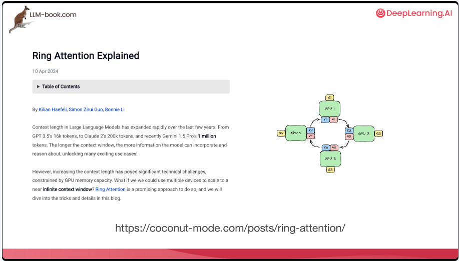

🔗 *Vedi blog post: “Ring Attention Explained”*

---

## 📊 Esempio: Architettura LLaMA 3.1 (8B)

| Componente                  | Valore           |
|----------------------------|------------------|
| 🔢 Layers                  | 32               |
| 📐 Model Dimension         | 4096            |
| ⚙️ FFN Dimension           | 14.336          |
| 👀 Attention Heads         | 32               |
| 🔄 GQA (Key/Value Heads)   | 8               |
| 🧠 Vocabolario             | 128.000 token    |
| 📍 Positional Embeddings   | RoPE (Rotary)    |


Dove:
- Model Domension: lunghezza dei vettori che attraversano il trasformer
- FFN Dimension: Feed Forward Neural-Network Dimension che indica quante unità ci sono nella parte FFNN  
- Vocabolario: numero di token che il modello può rappresentare (usando il suo tokenizer).

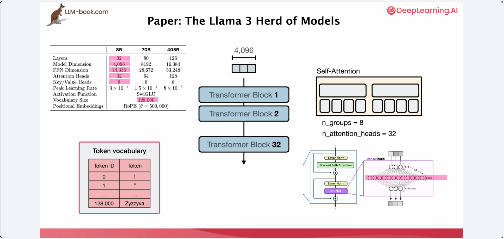

---

## 📚 Riferimenti e Risorse

- [DeepLearning.AI – corso sull'attenzione](https://www.deeplearning.ai)
- Paper: *Generating long sequences with sparse transformers*
- Blog post: *Ring Attention Explained*
- Documentazione: Meta – LLaMA 3.1 Models

---

✅ Ora sei pronto a leggere paper tecnici su architetture Transformer comprendendo il significato di tabelle, parametri e meccanismi come QKV, heads, gruppi, sparse attention e altro ancora.
