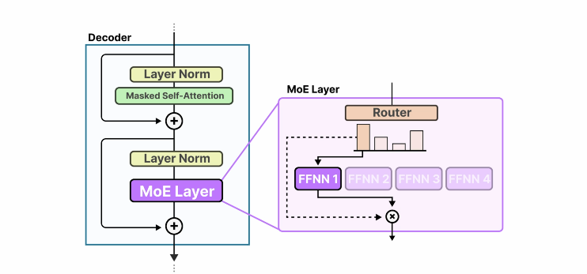

# 🧠 Evoluzioni recenti nei Transformer LLM – Architettura, Positional Encoding e Mixture of Experts

---

## 🔁 Riepilogo rapido: cos'è un Transformer Decoder?

- Il **Transformer originale del 2017** era un'architettura encoder–decoder.
- Oggi la **maggior parte dei LLM** è basata solo sul **decoder**, ottimizzato per la generazione di testo.
- I token in input vengono **vettorializzati**, e si applica una codifica posizionale per mantenere l’ordine.

---

## 🧱 Architettura moderna vs. originale

Molti LLMs hanno solamente la parte di decoder senza la parte di encoder, dunque ci focalizziamo sulla parte di decoder degli LLMs e vediamo come questa architettura è cambiata dal 2017 fino a oggi.

| Componente | Transformer 2017 | Transformer Moderni |
|------------|------------------|----------------------|
| Positional Encoding | Statico, all'inizio | Dinamico (es. Rotary) nel self-attention |
| Normalizzazione | Dopo i layer | Prima dei layer (pre-norm) |
| Self-Attention | Classico | Evoluzioni: *Grouped Query Attention* |
| Residual Connections | Presenti | Ancora presenti, ma spesso non disegnate |

---

## 📍 Positional Encoding: statico vs. dinamico

Abbiamo delle parole nel prompt, che vengono splittate in token. Poi questi token diventano, vettori. 

Positional encoding è un metodo per applicare positional information, altrimenti questa (informazione posizionale) sarebbe rappresentata al modello come una bag-of-words, dove non c'è alcun ordine per queste parole.

L'ordine delle parole in una sequenza è troppo importante, quindi positional encodings è uno dei tanti metodi per aggiungere informazione posizionale alla rappresentazione dei vettori.

POi questi vettori con l'informazione posizionale vanno dentro il transformer.

### ⏱️ Statico:
- Ogni posizione ha un **vettore fisso** (1, 2, 3, …).
- Può essere **predefinito** (seno/coseno) o **appreso**.
- Limiti nei modelli con **context window molto ampia**.

### 🔁 Dinamico (es. Rotary Embeddings):
- La posizione è **relativa** tra token.
- Utilizzato nei modelli recenti per **miglior gestione del contesto lungo**.
- La posizione viene aggiunta **durante il self-attention**, nei vettori di query e key.

---

## 🧪 Allenamento: gestione del contesto e padding

- Addestrare LLM su **batch di documenti**.
    - Ciascuna riga nel batch è un documento. 
    - Diciamo di star addestrando un modello con 16000 di context window. Il documento o molti documenti piccoli non saranno in grado di riempire tale spazio. Quindi aggiungiamo il padding per il resto del context.
    - Se lo facciamo naively, avremo la maggior parte dei documenti che non riempiono il context e dove aggiungiamo il padding per riempire lo spazio. Questo è un modo inefficiente di collettare training data.
    
- Context window lunga (es. 16k token) → rischio di **sprecare spazio** con padding.

- Un modo più efficiente di collettare questi documenti per il training è di impacchettarli dentro una riga del nostro batch e fare lo stesso con le seguenti righe. In questo modo finiremo con avere meno padding.
- Miglior strategia: **packing efficiente** di documenti multipli per ridurre il padding e sfruttare meglio la GPU.
- Implicazioni sulla **positional encoding**, che deve distinguere i documenti nel batch.

- Diciamo ad esempio che il modello si sta addestrando sul documento numero 2:
    1. Il meccanismo di self-attention non sarebbe in grado di distinguere i token del documento 1. 
    2. La proprietà dei Positional encoding è necessaria qui per dare modo al modello di distingure i token dei vari documenti, di dire "ok, questo è il primo token del documento 1" e così via. Nel conteggio di, quale token, quale posizione siamo al momento nel context length, supportiamo un modo in cui il modello può dar senso ai token dei rispettivi documenti, e quindi dire "ok, questo è il token numero 2 del documento 2" senza dover contare tutti i token dei precedenti documenti e di quelli che precedono il token corrente.
    3. Questa è l'intuizione che sta alla base dl perchè i modelli più recenti usano metodi di positional encoding come il **rotary embeddings**

---

## 🔬 Rotary Embeddings (ROPE)

- Aggiunge informazione posizionale **prima del calcolo della self-attention**.
- Agisce sui vettori *query* e *key*.
    - Prima dello step di relevance scoring del self-attention, ROPE ha una formulazione che aggiunge la informazione posizinale ai vettori **queries** e **keys**. 
    - Dunque questi vettori avranno l'informazione posizionale che denota: "ok, tale vettore (token) precede quest'altro vettore. 
- Modelli moderni lo preferiscono per:
  - Efficienza
  - Generalizzazione su contesti lunghi
  - Gestione del posizionamento relativo

---

## 🧩 Mixture of Experts (MoE)

### 💡 Concetto:

- Si usano più sottomodelli per migliorare la qualità degli LLMs.

- Ogni layer contiene **più sottoreti neurali (experts)**. 
- Un **router** decide quale expert (sottorete neurale) deve processare ogni token.

### 🧠 Intuizioni chiave:
- Gli experts **non sono tematici** (es. "esperto di biologia"), ma **funzionali** (es. punteggiatura, verbi...) quindi tendono a concentrarsi su specifiche tipologie di token e su come processarli.
- Ogni layer ha i **suoi experts e il suo router**.

- La scelta dell'expert, per processare un determinato token, può **cambiare layer per layer**.
- In alcuni casi, un token può essere processato da **più experts**, con fusione dei risultati.

### ⚙️ Struttura:
- Gli experts si trovano **nella parte feed-forward** del layer transformer.
- Il **router** è un classificatore che seleziona l’expert più adatto al token.

---

## 📌 Conclusione

- I LLM moderni hanno evoluto la struttura dei Transformer classici, adattandola a:
  - Maggiore efficienza
  - Contesti più lunghi
  - Meglio utilizzo delle risorse
- Tecniche come ROPE e Mixture of Experts migliorano le prestazioni **senza compromettere la qualità**.

