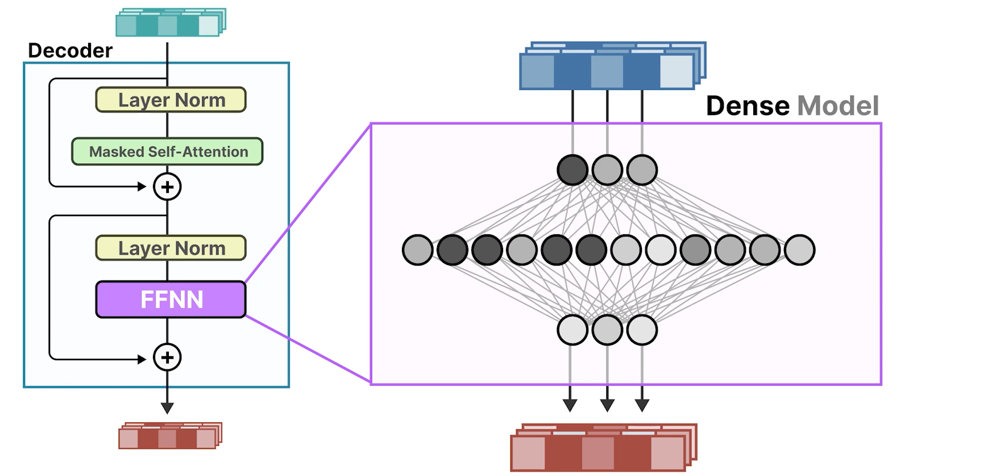
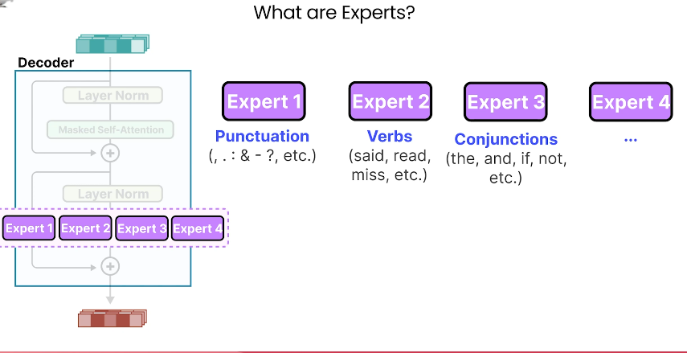
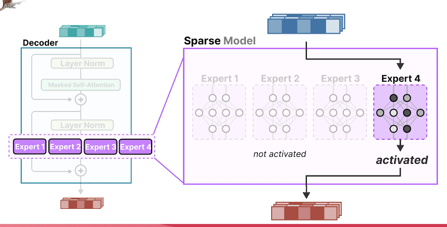
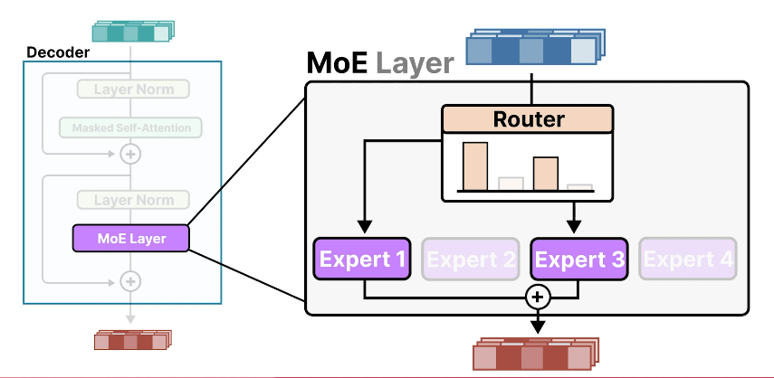
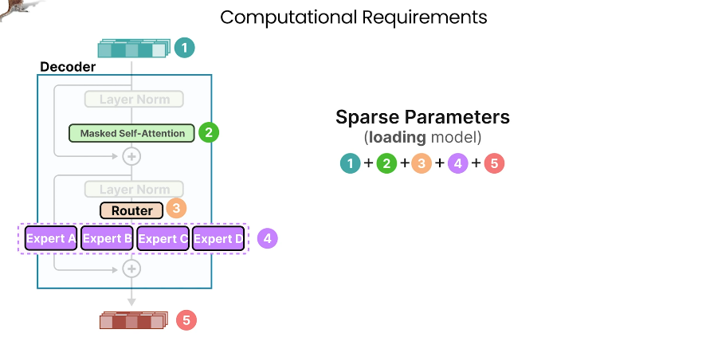
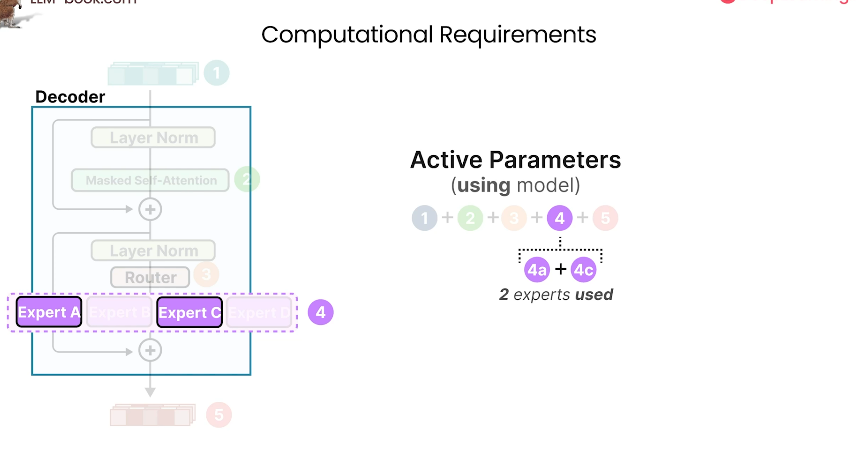
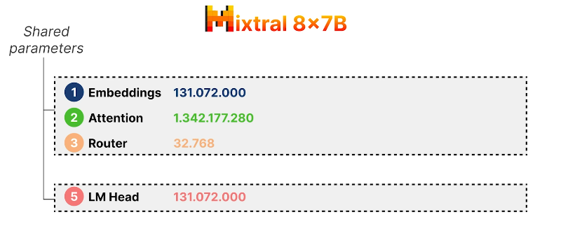
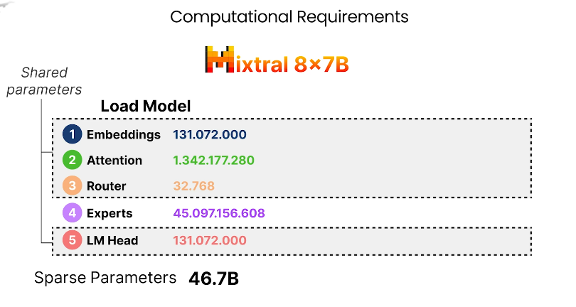
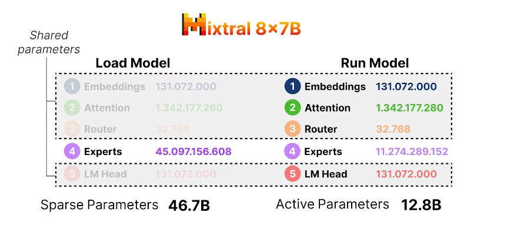

# 🧠 Mixture of Experts (MoE): Funzionamento, Architettura e Vantaggi

---

## 🔍 Cos'è il Mixture of Experts?

Il **Mixture of Experts (MoE)** è una tecnica avanzata che estende l'architettura dei Transformer introducendo **"esperti" dinamici**.

L'obiettivo è:
- Migliorare l'efficienza computazionale
- Aumentare la qualità della generazione
- Ridurre la ridondanza del calcolo

---

## 🧱 Struttura base di un decoder Transformer

1. **Input**: vettori dei token in input
2. **Layer Normalization**
3. **Self-Attention mascherata**
    - Applichiamo la self-attention masked agli inputs per pesare i token in base alla loro importanza relativa al contesto di tutti gli altri token.
    - Questo output è aggregato assieme con gli inputs non processati creando sia un direct che un indirect path.
    - Questo vonclude la parte più importante dei transformer models (attention mechanism).
    - Il meccanismo di attentione prepara gli input in tal modo che più informazione contestuale viene immagazzinata nei vettori. 
4. **Layer Normalization**
    - I vettori uscenti dal meccanismo di attenzione aggregati assieme ai vettori non processati sono poi normalizzati prima di essere processati da una **feed-forward neural network**.
5. **Feed-Forward Neural Network (FFN)**
    - Tale rete è tipicamente una dei più grandi componenti di un LLM, poichè il suo scopo è trovare relazioni complesse nell'informazione processata dal meccanismo di attenzione.
    - La rete feedforward prende gli input e li processa attraverso uno o più hidden layers, questa è chiamata dense network dato che tutti i paramentri della rete sono attivati e usati.

6. **Output**

Nella versione classica, il FFN è **denso**: ogni token attiva **tutti** i parametri.

---

## 🔄 Introduzione del Mixture of Experts

Il MoE **sostituisce il feed-forward network singolo** con:
- ✅ **Più reti neurali** (chiamate *experts*)
- ✅ Un **router** che seleziona quale expert usare per ogni token

> Questo crea un **modello sparso**: solo alcuni esperti vengono attivati per ogni input.

---

## 🧠 Gli esperti (Experts)

- Ogni *expert* è una rete neurale feed-forward.
- Gli esperti **non sono specializzati per dominio tematico**, ma per pattern lessicali (es. verbi, punteggiatura...).

- Quando l'input scorre attraverso questo expert layer, uno o più esperti sono selezionati e questi processeranno gli inputs, notare che si attivano solo gli esperti selezionati, gli altri rimangono disattivi. Questo viene chiamato **sparse model**, dato che solo un sottoinsieme di esperti vengono attivati in un certo istante.

- Con questo **sparse model** spesso ci riferiamo come **MoE layer**.

- Il MoE layer quindi consiste di uno o più esperti ciascuno dei quali è una rete neurale feed-forward, questo MoE layer prende in input i dati e seleziona un esperto che è più adatto per il dato di input per generare l'output.  

- Come facciamo a sapere quali inputs dovrebbero andare a quale esperto?  

- Quì entra in gioco il **Router**.

---

## 📡 Il router

- Il compito principale del **Router** è quello di scegliere quale input deve andare verso quale esperto.

- Proprio come gli esperti il Router è una rete neurale feedforward FFN, ma mlto più piccola dato che deve solo instradare gli inputs, che assegna una **probabilità** a ciascun expert, che indica quanto un esperto è adatto per tale input in particolare.

- Dopo aver creato i punteggi di probabilità, uno per ciascun esperto, il router decide **quali esperti attivare** in base a questi punteggi di probabilità (es. massimo punteggio o media pesata).
- Può selezionare:
  - Un singolo expert
  - Più esperti → aggregazione con **media pesata** dei loro output. Gli esperti con le probabilità più alte, date dal router, finiranno per avre maggiore voce in capitolo nel output finale.

---

## ✅ Vantaggi del MoE

I parametri di un modello che usa un MoE (Router + experts) possono trovarsi in sostanza in 5 posti diversi:

### 🧮 Parametri in un modello MoE

Le componenti che contengono parametri:
1. Input Embeddings
2. Self-Attention
3. Router
4. Experts
5. Output Embeddings

#### ✅ Parametri **sparsi**:
- Quando carichiamo un modello dobbiamo caricare tutti i parametri.

- Solo **una parte è usata** durante l’inferenza

#### ✅ Parametri **attivi**:
- Quelli **realmente utilizzati** per elaborare l'input.

- Con MoE non tutti gli esperti vengono utilizzati. Quindi, sebbene abbiamo bisogno di caricare tutti i parametri del modello, solo un sottoinsieme di essi viene utilizzato (parametri di uno o più esperti) durante l'inferenza.

- Come risultato, la quantità di memoria necessaria per caricare l'intero modello è relativamente alta per via dei molteplici esperti. Tuttavia, la memoria necessaria durante l'inferenza è comparativamente bassa dato che non tutti gli esperti vengono utilizzati.

---

## 📊 Esempio: modello Mixtral 8x7B

- È un MoE model che, comeil suo nome suggerisce, ha 8 experts, ciascuno con **~7 miliardi** di parametri.

- I parametri condivisi di Mixtral sono quelli che vengono sempre usati sia quando carichiamo il modello che quando si fa l'inferenza.  

- La maggior parte dei parametri si trovano nel meccanismo di attenzione con più di un billion di parametri.

- **Router**: ha solo **32.000** parametri

- Mixtral ha 8 esperti ciascuno dei quali ha in effetti ha 5.6 Billion di parametri e non i 7 Billion suggeriti dal nome.
- Assieme gli esperti fanno un Totale parametri pari a: 8 * 5.6 Billion = **~46 miliardi**. Questi dunque occupano il maggior mìnumero di parametri del modello.

- Dunque quando carichiamo Mixtral dobbiamo caricare tutti i 46.7 Billion di parametri.

- Eseguendo il modello e performando l'inferenza richiede i parametri condivisi.
- Tuttavia, Mixtral seleziona solo **2 experts usati per volta** → riducendo di molto i parametri usati (12.8 Billion) durante l’inferenza.

- Sebbene, il numero dei paramentri possa sembrare enorme, durante l'inferenza, il modello in realtà ne usa molti di meno impiegando meno risorse computazionali.

- Questo rende i modelli MoE eccellenti quando gli eseguiamo in produzione 

---

## Pros della architettura MoE

| Aspetto | Vantaggio | Svantaggio
|--------|-----------|-------------|
| Memoria VRAM | ✅ Usa meno VRAM durante l'inferenza perché pochi esperti attivi | ❌ Usa molta VRAM per caricare l'intero modello
| Efficienza | ✅ Riduzione della ridondanza computazionale | 
| Prestazioni | ✅ Migliori rispetto ai modelli densi tradizionali | ❌ Overfitting quando si usa un singolo esperto
| Flessibilità | ✅ Gli esperti possono essere modulati e aggiornati |

## ⚠️ Svantaggi e sfide

- 🚨 **Overfitting** su un singolo expert → serve bilanciamento attento
- 🧠 Architettura più **complessa da addestrare**
- 🧱 Serve **più memoria** per caricare il modello completo

---

## 🔄 MoE oltre i Transformer

- Il layer MoE agisce **solo sul feed-forward** layer
- Può essere applicato anche a modelli **non Transformer**
  - Es: **Mamba**, **Jamba**
- Applicabile **in tutto il panorama LLM**, non solo nei decoder

---

## 📌 Conclusione

Il Mixture of Experts è una potente evoluzione architetturale che permette:
- Scalabilità
- Flessibilità
- Maggiore efficienza durante l’inferenza
